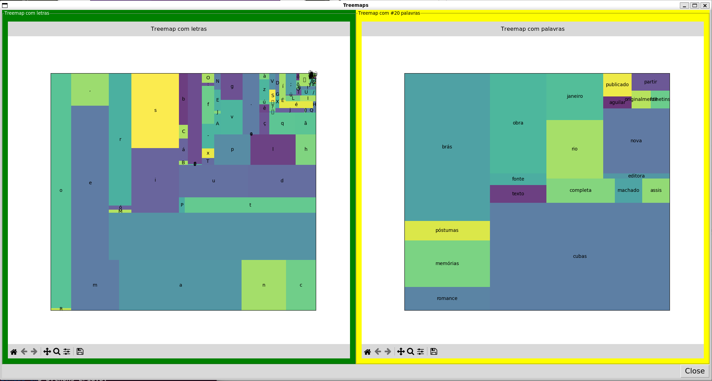
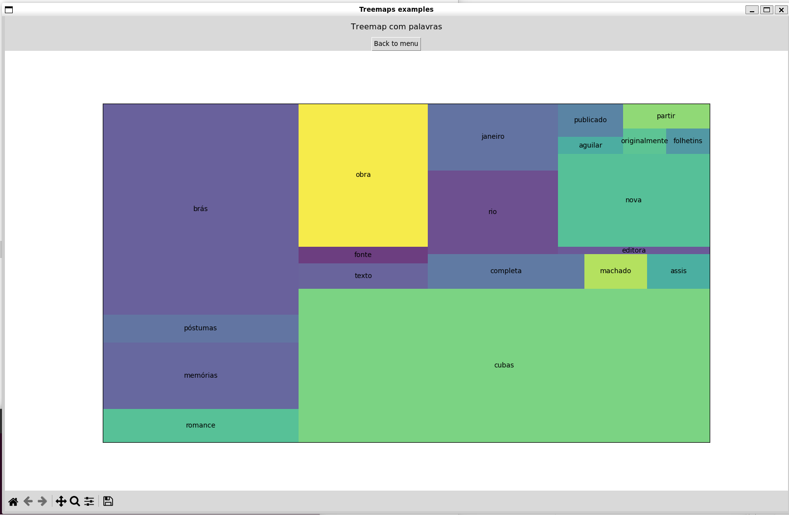
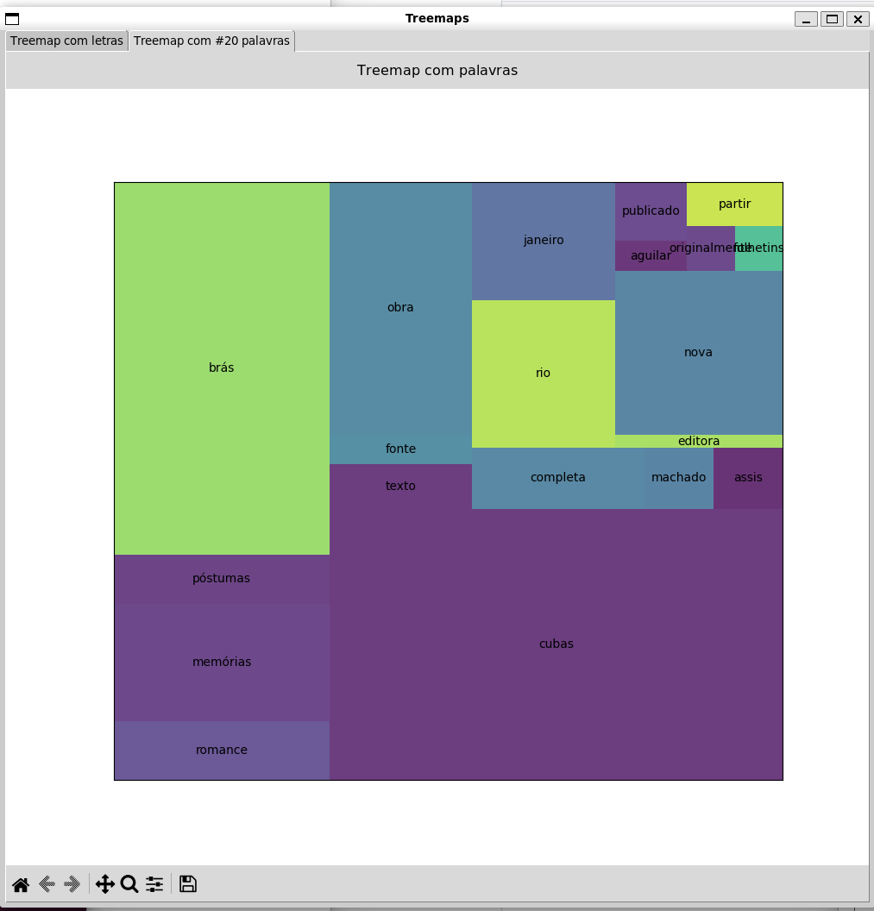

# Treemaps em janelas

Este repositório demonstra como usar dois recursos em Python:
- como desenhar `treemaps` usando matplotlib
- como colocar os gráficos gerados com matplotlib dentro de janelas

## Instalar requerimentos

```
python3 -m venv venv
source venv/bin/activate

pip3 install -r requirements.txt
```

## Treemap


Os treemaps (mapas de árvore) são uma forma alternativa de visualizar a estrutura hierárquica de um diagrama de árvore, no qual as quantidades para cada categoria são representadas por meio do tamanho da área do retângulo no treemap. Assim, cada categoria é constitui um retângulo com retângulos das subcategoria aninhados dentro deste.

Quando uma quantidade é atribuída a uma categoria, seu tamanho de área é proporcional a essa quantidade e a quaisquer outras quantidades dentro da mesma categoria pai em uma relação de parte para todo.
O tamanho da área da categoria pai é o total de suas subcategorias.
Se nenhuma quantidade foi atribuída a uma subcategoria, sua área é dividida igualmente entre as outras subcategorias dentro da categoria pai.

A maneira como os retângulos são divididos e ordenados em sub-retângulos depende do algoritmo utilizado.
O algoritmo mais comum mantém cada retângulo o mais quadrado possível.

As vantagens dos Treemaps é sua visualização mais compacta e eficiente em termos de espaço para exibir hierarquias, que permite comparar as proporções entre as categorias por meio do tamanho da área.
A desvantagem é que eles não mostram os níveis hierárquicos, como em Diagramas de Árvore ou Diagrama Sunburst.

### Visualização

Neste repositório utilizamos a biblioteca [squarify](https://github.com/laserson/squarify) que pode ser facilmente instalada com `pip` em Python.


```
python3 plots.py
```


## Tkinter

__Tkinter__ é uma biblioteca GUI para Python utilizando uma interface orientada a objetos para o [Tk GUI](https://en.wikipedia.org/wiki/Tk_(software)). O ponto interessante é que Tk é `independente` de plataforma, ou melhor, ele tenta ser o mais independente possível.

Algumas opção de apresentação dos gráficos em janelas via Tkinter:

### Versão 1

Uma janela com gráficos lado a lado:

```
python3 grid.py
```



### Versão 2

Uma janela com com menu de botoes:

```
python3 stack.py
```



### Versão 3

Uma janela com guias:

```
python3 tabs.py
```

